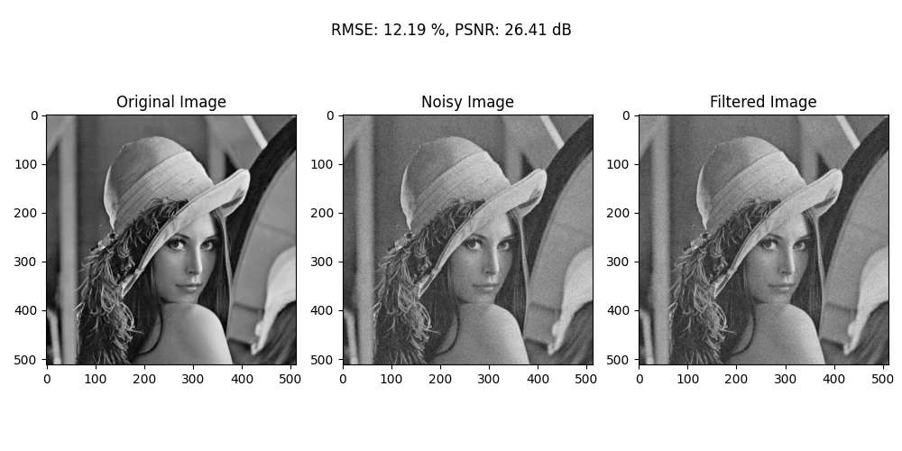

# Project Name: **Exposure Value Mean Filtering**

<div align="center">
  
</div>

---

## Introduction

This project includes a set of Python functions for performing various filtering comparisons . The project covers:

- ev Mean filtering
- Gaussian added noise

This README provides instructions on setting up the Python environment using `venv` and installing the required dependencies from `requirements.txt`.

## Setup Instructions

### 1. Clone the Repository
First, clone the project repository to your local machine (if applicable):
```bash

git clone https://github.com/RM25BAM/Image_Processing.git

cd Image_Processing

```

### 2. Create a Virtual Environment

It is recommended to use a Python virtual environment to manage the project's dependencies and avoid conflicts with other packages installed on your system. You can create a virtual environment using Python's built-in `venv` module.

**Step-by-step instructions to create a virtual environment:**

#### For Linux and macOS:
1. Open your terminal and navigate to the project directory.
2. Create a virtual environment named `venv` using the following command:
    ```bash

    python3 -m venv venv

    ```
3. Activate the virtual environment:
    ```bash

    source venv/bin/activate
    
    ```

#### For Windows:
1. Open the Command Prompt or PowerShell.
2. Create a virtual environment named `venv`:
    ```bash

    python -m venv venv

    ```
3. Activate the virtual environment:
    ```bash

    .\venv\Scripts\activate

    ```

After activating the virtual environment, your command prompt should show the virtual environment's name (`venv`), indicating that it is active.

### 3. Install Dependencies from `requirements.txt`

Once the virtual environment is activated, you can install the project's dependencies using the `requirements.txt` file.

**Command to install dependencies:**

```bash

pip install -r requirements.txt

pip3 install -r requirements.txt

```

This will install all the required Python packages for the project, ensuring you have the correct versions and libraries needed for execution.

### 4. Running the Project

After setting up the environment and installing the dependencies, you can run the Python scripts and functions as needed. If the project includes specific files, refer to the instructions in the documentation or comments within the code.

For example, you can run the image analysis and contrast enhancement functions in the project with:
```bash

cd project_3
python main.py

```

### 5. Deactivate the Virtual Environment

Once you're done working in the virtual environment, you can deactivate it by running:

```bash

deactivate

```

This will return you to the system's default Python environment.


## Additional Notes

- Make sure you have **Python 3.6 or higher** installed on your system.
- If any issues arise, ensure that the virtual environment is properly activated and all dependencies from `requirements.txt` have been installed. If not contact me through email: [Click Here](mailto:npiedrabuena01@manhattan.com)


Resources used in this project for better understanding of convolution kernel aside from slides